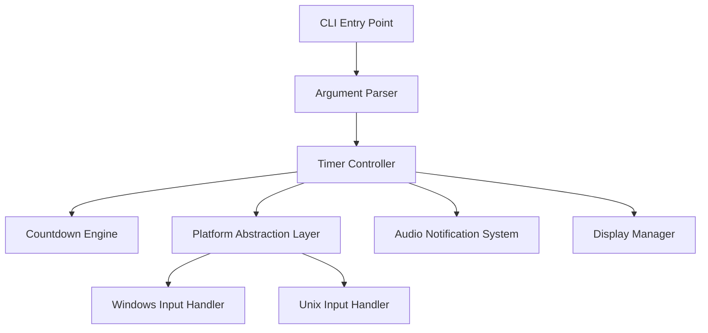

# Design Document

## Overview

Shellpomodoro is a minimalist, cross-platform Pomodoro timer CLI application built with Python's standard library. The design emphasizes simplicity, zero external dependencies, and seamless cross-platform operation. The application follows a linear state machine pattern where users progress through work and break phases with manual transitions controlled by keypress input.

## Architecture

### High-Level Architecture



### Core Components

1. **CLI Entry Point** (`cli.py:main`): Handles command-line argument parsing and application initialization
2. **Timer Controller** (`cli.py:run`): Orchestrates the Pomodoro session flow and state management
3. **Platform Abstraction Layer**: Provides cross-platform input handling through conditional imports
4. **Countdown Engine** (`cli.py:countdown`): Manages real-time timer display and user interruption
5. **Audio System** (`cli.py:beep`): Handles terminal bell notifications
6. **Display Manager**: Formats time display and manages console output

## Components and Interfaces

### CLI Interface

```python
def main() -> None:
    """Main entry point for shellpomodoro command"""
    
def parse_args(argv: List[str]) -> argparse.Namespace:
    """Parse command line arguments with validation"""
```

**Arguments:**
- `--work`: Work period duration in minutes (default: 25)
- `--break`: Break period duration in minutes (default: 5) 
- `--iterations`: Number of Pomodoro cycles (default: 4)
- `--beeps`: Number of notification beeps (default: 2)

### Timer Controller Interface

```python
def run(work: int, brk: int, iters: int, beeps: int) -> None:
    """Execute complete Pomodoro session with specified parameters"""
```

**State Flow:**
1. Initialize session parameters
2. For each iteration:
   - Execute work phase with countdown
   - Play notification beeps
   - Wait for user keypress (except final iteration)
   - Execute break phase with countdown (if not final iteration)
   - Play notification beeps
   - Wait for user keypress (if not final iteration)
3. Display completion message

### Platform Input Abstraction

```python
def read_key(prompt: str = "Press any key to continue...") -> None:
    """Cross-platform single keypress input without Enter requirement"""
```

**Windows Implementation:**
- Uses `msvcrt.getch()` for immediate keypress detection
- No terminal mode changes required

**Unix Implementation:**
- Uses `termios` and `tty` modules for raw terminal mode
- Context manager ensures proper terminal restoration
- Handles `sys.stdin.read(1)` for single character input

### Countdown Engine Interface

```python
def countdown(seconds: int, label: str) -> None:
    """Display real-time countdown with abort capability"""
```

**Features:**
- Updates display every 200ms for smooth countdown
- Shows MM:SS formatted time remaining
- Displays phase label and abort instructions
- Handles KeyboardInterrupt for graceful abort

### Audio Notification Interface

```python
def beep(times: int = 1, interval: float = 0.2) -> None:
    """Play terminal bell notifications with configurable count and spacing"""
```

## Data Models

### Session Configuration

```python
@dataclass
class SessionConfig:
    work_minutes: int = 25
    break_minutes: int = 5
    iterations: int = 4
    beep_count: int = 2
```

### Phase State

```python
class PhaseType(Enum):
    WORK = "Focus"
    BREAK = "Break"

@dataclass
class PhaseState:
    type: PhaseType
    duration_seconds: int
    iteration: int
    total_iterations: int
```

### Time Formatting

```python
def mmss(seconds: int) -> str:
    """Format seconds as MM:SS string with zero padding"""
    m, s = divmod(max(0, int(seconds)), 60)
    return f"{m:02d}:{s:02d}"
```

## Error Handling

### Signal Handling

- **SIGINT (Ctrl+C)**: Graceful session abort with cleanup
- **Implementation**: Custom signal handler that raises KeyboardInterrupt
- **Behavior**: Displays "Aborted." message and exits with code 1

### Platform-Specific Error Handling

**Windows (`msvcrt` errors):**
- Handle import failures gracefully
- Fallback to input() if msvcrt unavailable

**Unix (`termios`/`tty` errors):**
- Context manager ensures terminal state restoration
- Handle file descriptor errors for non-terminal environments
- Graceful degradation to standard input if raw mode fails

### Input Validation

- **Argument validation**: Ensure positive integers for time parameters
- **Range validation**: Reasonable limits on work/break durations
- **Type validation**: Convert string arguments to appropriate types

## Testing Strategy

### Unit Testing Approach

1. **Timer Logic Tests**
   - Verify countdown calculation accuracy
   - Test time formatting edge cases (0 seconds, large values)
   - Validate session flow state transitions

2. **Platform Abstraction Tests**
   - Mock platform detection logic
   - Test input handling on different platforms
   - Verify graceful fallbacks for unsupported environments

3. **CLI Interface Tests**
   - Argument parsing validation
   - Default value verification
   - Error handling for invalid inputs

4. **Integration Tests**
   - End-to-end session simulation with mocked time.sleep
   - Cross-platform compatibility verification
   - Signal handling behavior validation

### Testing Utilities

```python
def mock_time_sleep(duration: float) -> None:
    """Mock time.sleep for fast test execution"""

def simulate_keypress() -> None:
    """Simulate user keypress for automated testing"""

def capture_terminal_output() -> str:
    """Capture and verify terminal output formatting"""
```

### Test Coverage Goals

- **Core Logic**: 100% coverage of timer and countdown functions
- **Platform Code**: Test both Windows and Unix code paths
- **Error Paths**: Verify all exception handling scenarios
- **CLI Interface**: Complete argument parsing and validation coverage

## Package Structure

```
shellpomodoro/
├── pyproject.toml          # PEP 517/518 build configuration
├── README.md               # Installation and usage documentation  
├── LICENSE                 # MIT license (optional)
└── src/
    └── shellpomodoro/
        ├── __init__.py     # Package initialization
        └── cli.py          # Complete CLI implementation
```

### Build Configuration (pyproject.toml)

- **Build System**: setuptools>=68 with wheel support
- **Dependencies**: Empty list (stdlib only)
- **Entry Points**: `shellpomodoro = "shellpomodoro.cli:main"`
- **Python Requirement**: >=3.9 for modern typing support
- **Metadata**: Version, description, author, license information

### Distribution Strategy

1. **Development Installation**: `pip install -e .` for local development
2. **Production Installation**: `pip install shellpomodoro` from PyPI
3. **Alternative Installation**: `pipx install .` for isolated CLI tools
4. **Build Artifacts**: `python -m build` generates wheel and sdist

## Implementation Notes

### Cross-Platform Considerations

- **Terminal Bell**: Uses `\a` character, may require terminal configuration
- **Input Handling**: Platform-specific implementations with consistent interface
- **Signal Handling**: Works across Unix and Windows environments
- **Path Handling**: Uses pathlib for cross-platform file operations

### Performance Characteristics

- **Memory Usage**: Minimal footprint with no external dependencies
- **CPU Usage**: Low impact with 200ms update intervals
- **Startup Time**: Fast initialization with stdlib-only imports
- **Responsiveness**: Immediate keypress detection on all platforms

### Future Enhancement Opportunities

1. **Audio Improvements**: OS-specific sound APIs (winsound, ossaudiodev)
2. **Visual Themes**: ASCII art variations with pyfiglet integration
3. **Configuration Files**: User preferences and session templates
4. **Progress Tracking**: Session history and productivity metrics
5. **Integration**: IDE plugins and system tray notifications